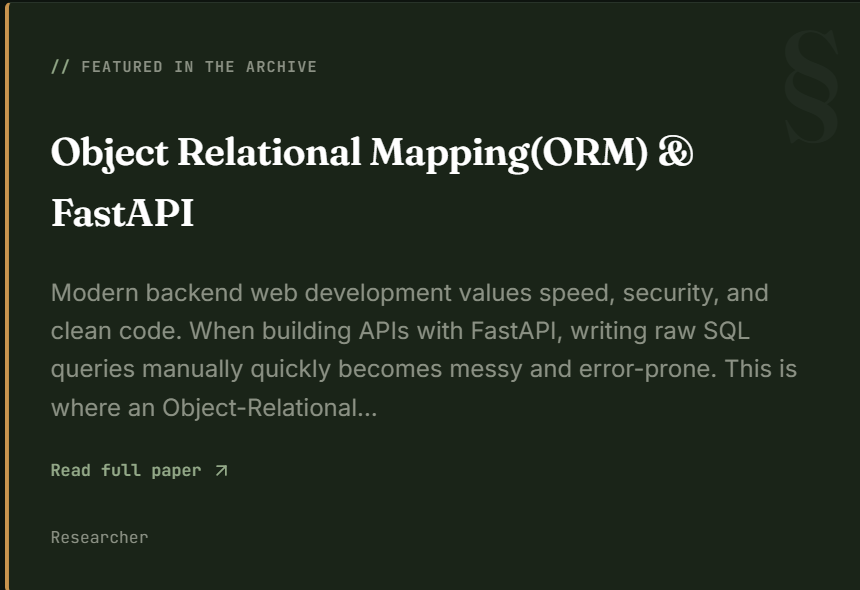
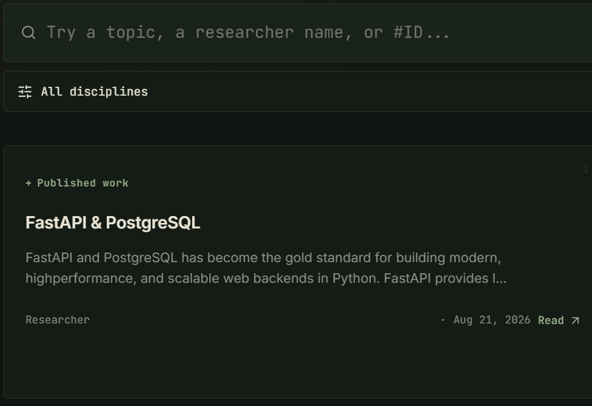
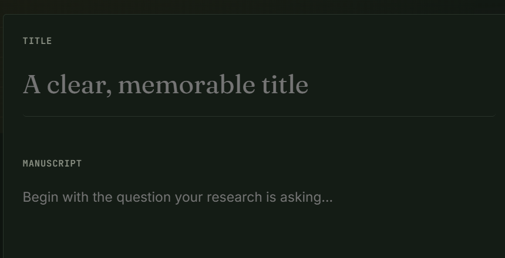
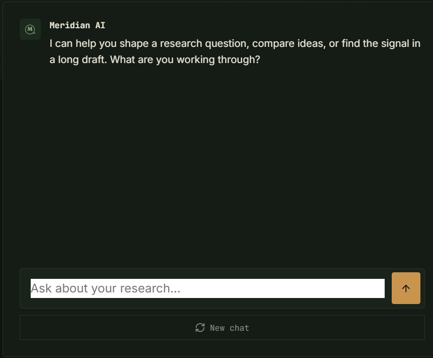
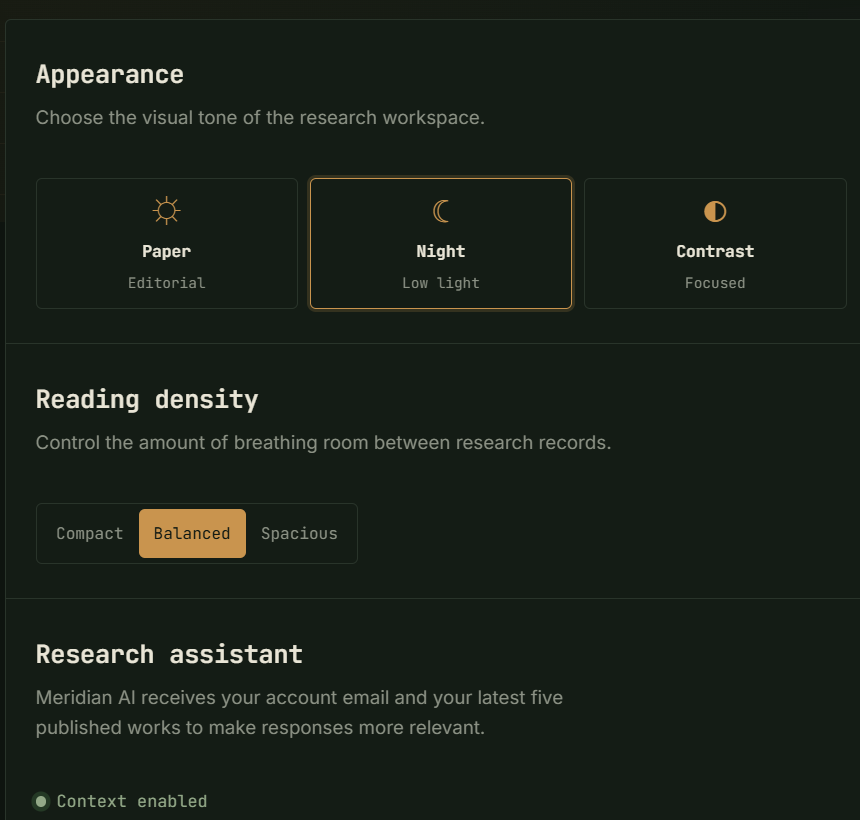

<div align="center">

# Meridian

### A research-sharing REST API and web experience, built with FastAPI.

Publish and discover research posts, manage your account, and optionally ask an AI research assistant for help.


</div>

---

## About

Meridian is a practice project that brings a FastAPI REST API together with a responsive browser interface. Users can register, sign in, publish research posts, and browse the shared collection. Authenticated users can manage their own posts, and can optionally use a Gemini-powered assistant that considers their recent publications.

> **Learning project:** This repository is intended for practice and demonstration. Review authentication, data handling, and deployment choices before using it with real users or making it publicly accessible.

## What you can do

| Explore | Publish | Manage | Get assistance |
| --- | --- | --- | --- |
| Browse, search, and read research posts in the web interface. | Create an account and share a post. | Update or delete posts you own. | Ask the optional Gemini assistant about your work. |

### Interface preview

The browser app is served by the API at `/ui`. It includes latest research, discovery and search, publishing, a researcher profile, preferences, and an assistant view. The interface uses plain HTML, CSS, and JavaScript—no frontend build step is required. The images below are focused crops captured from the running local app; identifying author emails have been replaced with generic labels.

#### 1. Latest research

The home screen highlights featured work, recent publications, and research disciplines to explore.

<p align="center"></p>

#### 2. Discover and search

The discovery view provides a searchable archive with topic, researcher, and publication-ID queries, plus a discipline filter. Each result shows a short preview and a link to open the full post.

<p align="center"></p>

#### 3. Publish work

Authenticated researchers can write a post with a title and Markdown-supported manuscript, then publish it to the shared archive.

<p align="center"></p>

#### 4. Research assistant

The assistant view provides a chat interface for research questions and synthesis. When configured, the API sends the question, the signed-in account email, and up to the researcher's five most recent publications (up to 500 characters of each post's content) to Google Gemini. Do not enable the integration with data you are not comfortable sending to that external service.

<p align="center"></p>

#### 5. Workspace settings

Researchers can select an appearance and reading density. These preferences are saved in the current browser and do not change other users' views.

<p align="center"></p>

## How SQLAlchemy is used

SQLAlchemy is the application's ORM layer between the FastAPI routes and PostgreSQL:

- **Engine and session factory:** `app/database.py` reads the database URL from `app/pass.env`, creates a SQLAlchemy engine, and binds `SessionLocal` to it.
- **Request-scoped sessions:** Routes request a `Session` through FastAPI's `Depends(get_db)`. The dependency yields a session for the request and closes it in a `finally` block.
- **Mapped tables:** `app/models.py` declares `User` and `Post` ORM models. Their columns define the `users` and `posts` tables, including the post-to-user foreign key.
- **Queries and writes:** The post routes use ORM queries to list and filter records. Creating a post adds a `Post` object, commits the transaction, and refreshes it to load database-generated values. Updates and deletes are scoped to the signed-in owner's ID and committed to the database.
- **Startup table creation:** `app/main.py` calls `Base.metadata.create_all(bind=engine)` to create mapped tables that do not yet exist. The PostgreSQL database itself must already exist; this `create_all` call is not a schema migration system.
- **API validation stays separate:** Pydantic schemas in `app/schema.py` validate request bodies and shape API responses; the SQLAlchemy models represent persisted database rows.

For example, the ORM model describes a post, and a route persists one with `db.add(new_post)` followed by `db.commit()`. This project uses SQLAlchemy sessions and mapped models directly rather than writing raw SQL for its normal CRUD routes.

## Built with

- **API:** FastAPI, Pydantic, SQLAlchemy
- **Database:** PostgreSQL
- **Authentication:** Password hashing and JWT bearer tokens
- **Frontend:** HTML, CSS, and vanilla JavaScript
- **Optional AI:** Google Gemini API
- **API testing:** FastAPI interactive Swagger docs and ReDoc

## Project layout

```text
FastAPI-Rest-API/
├── app/
│   ├── main.py                 # FastAPI application and UI routes
│   ├── auth.py                 # Login endpoint
│   ├── database.py             # PostgreSQL engine and database sessions
│   ├── models.py               # SQLAlchemy models
│   ├── oauth2.py               # JWT creation and bearer authentication
│   ├── schema.py               # API request and response schemas
│   ├── utils.py                # Password hashing helpers
│   ├── routers/
│   │   ├── assistant.py        # Optional Gemini research assistant
│   │   ├── posts.py            # Research post endpoints
│   │   └── users.py            # User endpoints
│   └── static/
│       ├── index.html          # Meridian web interface
│       ├── app.js              # Frontend behavior
│       └── styles.css          # Responsive styling
├── 01-latest-research.png      # README screenshot: latest research
├── 02-discover-search.png      # README screenshot: discovery
├── 03-publish-work.png         # README screenshot: publishing
├── 04-research-assistant.png   # README screenshot: assistant
├── 05-workspace-settings.png   # README screenshot: preferences
├── .env.example                # Safe local configuration template
├── .gitignore
├── README.md
└── requirements.txt
```

## Get started

### 1. Requirements

- Python 3.10 or newer
- PostgreSQL, with a database created for this project
- A Gemini API key only if you want to use the assistant

### 2. Create a virtual environment

Run from the repository root:

```powershell
python -m venv .venv
.\.venv\Scripts\Activate.ps1
```

On macOS or Linux, activate it with:

```bash
source .venv/bin/activate
```

### 3. Install packages

```bash
python -m pip install -r requirements.txt
```

### 4. Set local configuration

Copy the example file to the location read by the application:

```powershell
Copy-Item .env.example app/pass.env
```

Edit `app/pass.env` and set:

```env
DB_PASSWORD=postgresql+psycopg2://<db_user>:<db_password>@localhost:5432/<db_name>
SECRET_KEY=<replace-with-a-long-random-secret>
GEMINI_API_KEY=
```

`DB_PASSWORD` is the full SQLAlchemy PostgreSQL URL despite the variable name. Replace the sample values with your local database credentials and a private signing key. Set `GEMINI_API_KEY` only if you want to enable the assistant.

**Never commit `app/pass.env` or real credentials.** The file is excluded by `.gitignore`; `.env.example` contains placeholders only.

### 5. Start the development server

From the repository root:

```bash
uvicorn app.main:app --reload
```

Open the interface and API documentation:

| Page | Address |
| --- | --- |
| Meridian web app | <http://127.0.0.1:8000/ui> |
| Interactive Swagger docs | <http://127.0.0.1:8000/docs> |
| ReDoc | <http://127.0.0.1:8000/redoc> |

## API overview

| Method | Endpoint | Purpose | Auth |
| --- | --- | --- | --- |
| `POST` | `/users/` | Register a user | No |
| `GET` | `/users/{id}` | Retrieve a user by ID | No |
| `POST` | `/login` | Exchange credentials for an access token | No |
| `GET` | `/posts/` | List posts | No |
| `GET` | `/posts/latest` | Retrieve the latest post | No |
| `GET` | `/posts/{id}` | Retrieve a post | Yes |
| `POST` | `/posts/` | Publish a post | Yes |
| `PUT` | `/posts/{id}` | Update a post you own | Yes |
| `DELETE` | `/posts/{id}` | Delete a post you own | Yes |
| `POST` | `/assistant` | Ask the research assistant | Yes; Gemini key |

### Authentication

Log in at `/login` using form data. The email goes in the OAuth2 `username` field, alongside the password. The response contains an `access_token`; send it to protected endpoints as `Authorization: Bearer <access_token>`.

## Example: publish a post

First register an account:

```bash
curl -X POST http://127.0.0.1:8000/users/ \
  -H "Content-Type: application/json" \
  -d '{"email":"researcher@example.com","password":"choose-a-password"}'
```

Log in to get a token:

```bash
curl -X POST http://127.0.0.1:8000/login \
  -H "Content-Type: application/x-www-form-urlencoded" \
  -d "username=researcher@example.com&password=choose-a-password"
```

Use the returned token to publish:

```bash
curl -X POST http://127.0.0.1:8000/posts/ \
  -H "Authorization: Bearer <access_token>" \
  -H "Content-Type: application/json" \
  -d '{"title":"A research question","content":"Notes and findings go here.","published":true}'
```

## Try the API

Use the interactive Swagger page at <http://127.0.0.1:8000/docs> to inspect endpoints and send requests, or open ReDoc at <http://127.0.0.1:8000/redoc> for the generated API reference.

## Configuration notes

- The app creates SQLAlchemy tables at startup; ensure the configured PostgreSQL database already exists.
- Database and JWT settings are loaded from `app/pass.env`.
- The Gemini assistant is optional; without its API key, assistant requests return an unavailable response while the other API routes remain usable.
- No frontend compilation is needed; the static interface is served directly by FastAPI.

---

<div align="center">

Made as a FastAPI practice project.

</div>
